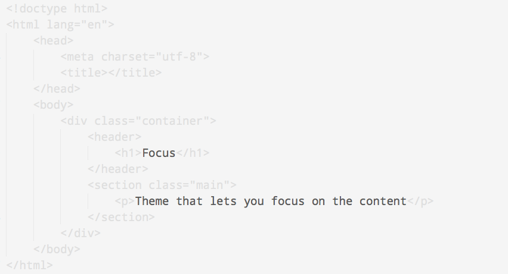
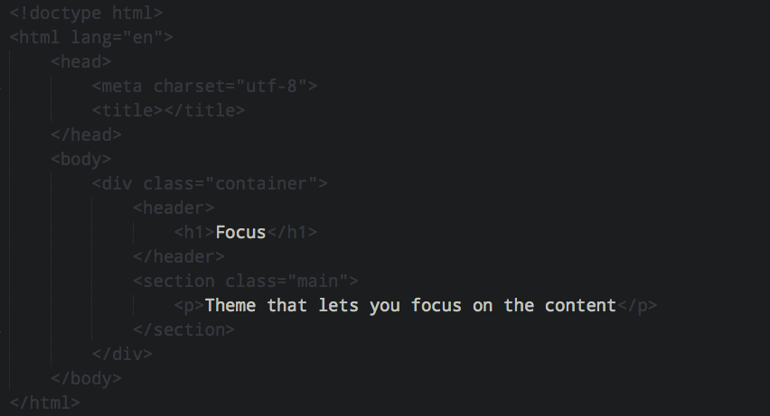

# Focus

> Theme that lets you focus on the content

For when you need to edit a lot of inline text without being distracted by code and markup.

## Install

### Sublime Text

Install with [Package Control](http://wbond.net/sublime_packages/package_control) and restart Sublime.

### TextMate 2

Copy the `.tmTheme` files to `~/Library/Application Support/Textmate/Managed/Bundles/Themes.tmbundle`.

### TextMate

Copy the `.tmTheme` files to `~/Library/Application Support/TextMate/Themes`.

### Vim

Copy the contents of the `vim` folder to `~/.vim/colors`.

### Chocolat

[Install instruction](http://chocolatapp.com/w/index.php?title=Install_Extras)

### Other editors

A lot more editors support the `.tmTheme` format. Google it if you're not using any of the above editors.

I would be more than happy to accept PRs for ports to other editors that doesn't support `.tmTheme`.

## License

[MIT License](http://en.wikipedia.org/wiki/MIT_License)
(c) [Sindre Sorhus](http://sindresorhus.com)
