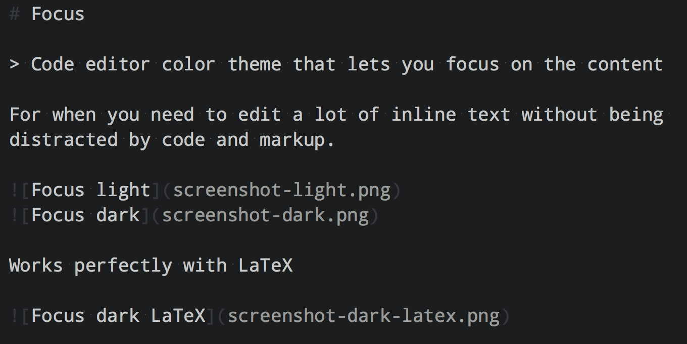
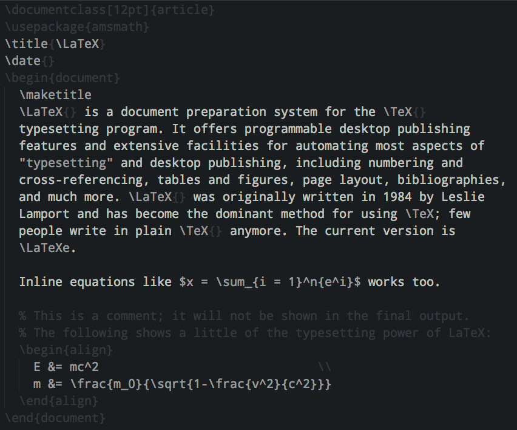

# Focus

> Code editor color theme that lets you focus on the content

For when you need to edit a lot of inline text without being distracted by code and markup.

#### Works perfectly with Markdown

#### And LaTeX

## Install

### Sublime Text

Install `Focus` with [Package Control](https://sublime.wbond.net) and restart Sublime.

### Atom

See [atom-focus-dark](https://github.com/sindresorhus/atom-focus-dark) and [atom-focus-light](https://github.com/sindresorhus/atom-focus-light).

### TextMate 2

Copy the `.tmTheme` files to `~/Library/Application Support/Textmate/Managed/Bundles/Themes.tmbundle`.

### TextMate

Copy the `.tmTheme` files to `~/Library/Application Support/TextMate/Themes`.

### Vim

Copy the contents of the `vim` folder to `~/.vim/colors`.

### Chocolat

[Install instruction](http://chocolatapp.com/w/index.php?title=Install_Extras)

### Other editors

A lot more editors support the `.tmTheme` format. Google it if you're not using any of the above editors.

I would be more than happy to accept PRs for ports to other editors that doesn't support `.tmTheme`.

## Dev

Click on some syntax then press Ctrl+Shift+P to see the scope in the statusbar.

## License

MIT © [Sindre Sorhus](http://sindresorhus.com)
